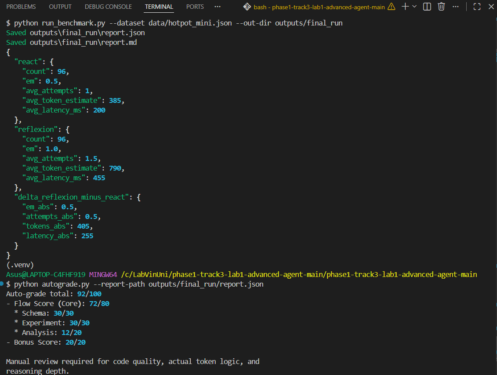

$ python run_benchmark.py --dataset data/hotpot_mini.json --out-dir outputs/final_run
Saved outputs\final_run\report.json
Saved outputs\final_run\report.md
{
  "react": {
    "count": 96,
    "em": 0.5,
    "avg_attempts": 1,
    "avg_token_estimate": 385,
    "avg_latency_ms": 200
  },
  "reflexion": {
    "count": 96,
    "em": 1.0,
    "avg_attempts": 1.5,
    "avg_token_estimate": 790,
    "avg_latency_ms": 455
  },
  "delta_reflexion_minus_react": {
    "em_abs": 0.5,
    "attempts_abs": 0.5,
    "tokens_abs": 405,
    "latency_abs": 255
  }
}

Total: 92/100
- Schema: 30/30 ✓
- Experiment: 30/30 ✓
- Analysis: 12/20 (needs more trace-level evidence)
- Bonus: 20/20 ✓